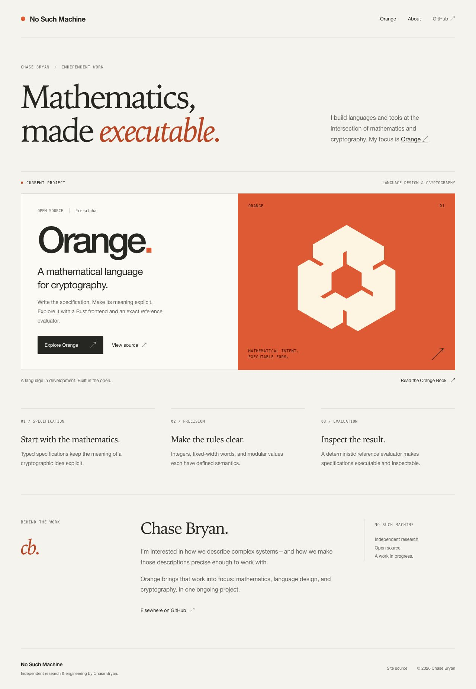

# No Such Machine

Chase Bryan’s independent work in mathematics and cryptography, centered on Orange.

**Production domain:** [nosuchmachine.net](https://nosuchmachine.net)



## Structure

- The homepage presents Orange as the sole main project, followed by a brief introduction to Chase. Navigation leads to Orange, the Orange Book, About, and GitHub.
- A restrained layout, readable type, and orange accents replace the project catalog and animated background. The homepage has no canvas visuals or motion controls.
- The complete Orange Book is hosted at `/book/`. The reading path opens with the drafted Part 1 novice lessons, then keeps the original manuscript's 24 sections, chapter navigation, section links, and local full-text search.
- All 40 existing project pages remain available at `/projects/<slug>/`, with their purpose, implementation, maturity, limitations, repository, and documentation links.
- `src/data/catalog.json` owns the project content. The [repository inventory](docs/repository-inventory.json) and [review report](docs/portfolio-review.md) record the public-repository review and earlier curation decisions.
- `src/data/book.json` records the book's publication metadata and chapter order; `src/content/book/` contains the generated chapter Markdown. The full upstream manuscript is retained in `vendor/orange/THE_ORANGE_BOOK.md` and available to download at `/book/orange-book.md`.
- The sitemap includes the catalog and all hosted book pages. Executable scripts must remain external to comply with the existing Cloudflare content-security policy.

## Develop

```sh
npm ci
npm run dev
npm run check
npm run build
npm run verify
npm run preview
```

`verify` confirms that Orange is the only featured catalog project and the only project linked from the homepage, and that the homepage has no canvas visuals or motion controls. It checks every hosted book chapter, reading order, previous/next links, active chapter navigation, search-index coverage, and consistency with the vendored manuscript. It also checks all generated project routes and source references, sitemap entries, internal links and anchors, image/script assets, unique IDs, one main landmark and heading per page, and CSP-compatible script output. CI runs the type check, build, and this integration check.

## Update the Orange Book

The hosted manuscript is Orange Book v0.27, snapshot October 5, 2026, from Orange revision [`7cfd1441ccacb461caeb4675119875235d1c1379`](https://github.com/chasebryan/orange/commit/7cfd1441ccacb461caeb4675119875235d1c1379), plus the open slice corrections in Orange pull requests [247](https://github.com/chasebryan/orange/pull/247), [253](https://github.com/chasebryan/orange/pull/253), and [248](https://github.com/chasebryan/orange/pull/248). Pull request 248 conflicts with the S3u corrections on the version line, so the hosted copy keeps S3u there and adds only its new universal-word section. Repository links inside the manuscript stay pinned to that revision, except the two S3v documents, which exist only on pull request 248.

The novice lessons are a draft of Part 1 from Orange branch `book/novice-journeyman-master-opening` at [`a5620df49f695423f32d1c7bfe0056a28a9773ae`](https://github.com/chasebryan/orange/commit/a5620df49f695423f32d1c7bfe0056a28a9773ae). Their prose also includes the open corrections in pull requests [246](https://github.com/chasebryan/orange/pull/246), [250](https://github.com/chasebryan/orange/pull/250), and [251](https://github.com/chasebryan/orange/pull/251). Those lessons are not merged, and two later novice lessons are still unwritten. Builds use the committed manuscript and lessons without fetching upstream content.

To import a newer edition from a local Orange checkout with a clean `docs/THE_ORANGE_BOOK.md`:

```sh
npm run sync:book -- --repo /path/to/orange
npm run check
npm run build
npm run verify
```

Review and commit the updated vendored manuscript, downloadable source, metadata, and chapter files together. The import records the source commit, preserves chapter URLs, and rewrites manuscript-relative links for the hosted reader. If a new edition changes the section structure, update the chapter map and descriptions in `scripts/sync-orange-book.mjs` and the pinned chapter count in `scripts/verify-build.mjs` as part of that edition review.

`npm run sync:book` regenerates chapters from the committed manuscript. `npm run sync:book -- --check` checks the generated metadata and chapters without writing files or accessing the network.

## Deploy

Cloudflare Pages Git integration is connected to this repository and successfully built the redesign preview on October 1, 2026. It publishes the production branch and branch previews without GitHub repository secrets. The Actions deployment workflow is a manual fallback; it requires `CLOUDFLARE_API_TOKEN` and `CLOUDFLARE_ACCOUNT_ID`, which were absent at review time.

Production apex `https://nosuchmachine.net` is a **Cloudflare** zone. Historically it was published by Cloudflare Pages project `wuci-ji` from [`chasebryan/-wuci-ji`](https://github.com/chasebryan/-wuci-ji). This repository is now the source of truth for the public portfolio.

`bottle.nosuchmachine.net` remains a separate Cloudflare Worker in `-wuci-ji` — do not remove that subdomain.

### Recommended: Cloudflare Pages (keep current host)

**Option A — Dashboard Git connect (no GitHub secrets)**

1. Cloudflare Dashboard → **Workers & Pages** → **Create** → **Pages** → **Connect to Git**.
2. Select `chasebryan/nosuchmachine.net`, production branch `main`.
3. Build settings:
   - Framework preset: **None**
   - Build command: `npm run build`
   - Build output directory: `dist`
   - Node version: `22`
4. Project name: `nosuchmachine-net` (matches `wrangler.toml`).
5. After the first green deploy: **Custom domains** → add `nosuchmachine.net` and `www.nosuchmachine.net`.
6. Open the old Pages project **`wuci-ji`** → **Custom domains** → **remove** `nosuchmachine.net` / `www` so only the new project owns the apex.
7. Confirm Always Use HTTPS + HSTS remain enabled on the zone. Keep Web Analytics / NEL off (same privacy posture as before).

**Option B — GitHub Actions + Wrangler**

1. Create a Cloudflare API token with **Cloudflare Pages — Edit** (and Account read).
2. In this repo: **Settings → Secrets and variables → Actions**, add:
   - `CLOUDFLARE_API_TOKEN`
   - `CLOUDFLARE_ACCOUNT_ID`
3. Merge the deploy workflow to `main` (or run **Deploy Cloudflare Pages** via `workflow_dispatch`).
4. Complete custom-domain cutover steps 5–7 from Option A if the project is new.

### Alternative: GitHub Pages

Only if you intentionally leave Cloudflare Pages for the apex:

1. Repo **Settings → Pages → Source: GitHub Actions**.
2. Uncomment the `push:` trigger in `.github/workflows/deploy-github-pages.yml`, merge, and run the workflow once.
3. In the Cloudflare DNS zone for `nosuchmachine.net`, replace Pages-managed apex records with GitHub Pages targets:
   - `A` `@` → `185.199.108.153`, `185.199.109.153`, `185.199.110.153`, `185.199.111.153`
   - `AAAA` `@` → `2606:50c0:8000::153`, `2606:50c0:8001::153`, `2606:50c0:8002::153`, `2606:50c0:8003::153`
   - `CNAME` `www` → `chasebryan.github.io`
4. Remove the apex/www custom domains from Cloudflare Pages project `wuci-ji` (and any `nosuchmachine-net` project) so Cloudflare stops answering for those hostnames.
5. Keep nameservers on Cloudflare if `bottle.nosuchmachine.net` (Worker) should stay put.

## License

GNU Affero General Public License v3.0 — see [LICENSE](LICENSE).
