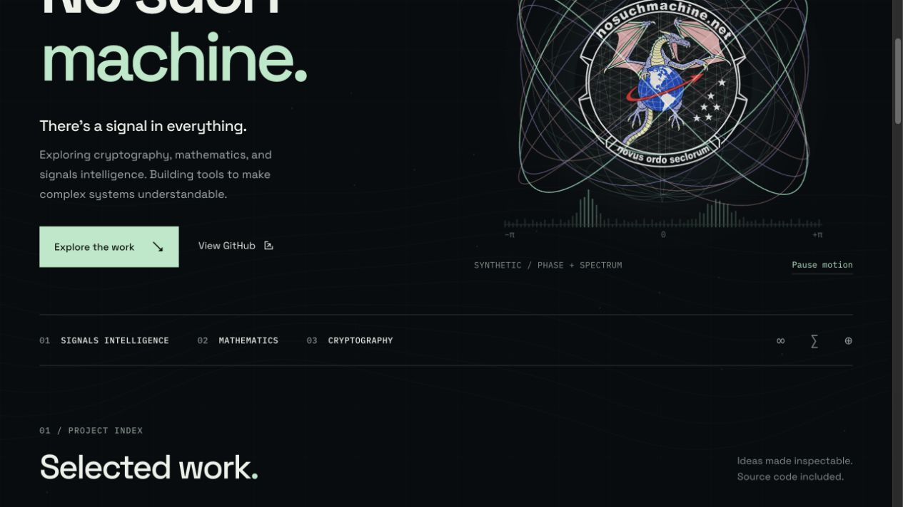

# No Such Machine

Chase Bryan’s portfolio of signals intelligence, mathematics, cryptography, systems, and independent research.

**Production domain:** [nosuchmachine.net](https://nosuchmachine.net)



## Structure

- The homepage presents three featured projects, 18 core projects, and an expandable collection of 22 further explorations.
- Every listed project has a statically generated page at `/projects/<slug>/`, with its purpose, implementation, maturity, limitations, repository, and documentation links.
- `src/data/catalog.json` owns the portfolio content. The [repository inventory](docs/repository-inventory.json) and [review report](docs/portfolio-review.md) record the public-repository review and curation decisions.
- `src/scripts/signal-field.ts` renders synthetic phase-space curves, a spherical lattice, spectrum peaks, and a subtle background signal field. These visuals are mathematical simulations. They use no microphone, receiver, network data, or visitor telemetry.
- Motion respects reduced-motion preferences, can be paused on every page, and stores an optional local preference. The user-supplied dragon insignia anchors the identity.
- The sitemap is generated from the catalog, and the built animation script stays external to comply with the existing Cloudflare content-security policy.

## Develop

```sh
npm ci
npm run dev
npm run check
npm run build
npm run verify
npm run preview
```

`verify` checks generated project routes, homepage links, sitemap entries, internal links and anchors, image/script assets, unique IDs, motion controls, and CSP-compatible script output. CI runs the type check, build, and this integration check.

## Deploy

The deployment run inspected on October 1, 2026 failed because both `CLOUDFLARE_API_TOKEN` and `CLOUDFLARE_ACCOUNT_ID` repository secrets were absent. The build succeeded. Configure the existing Pages integration or the secrets below before publishing; do not change DNS solely to preview the redesign.

Production apex `https://nosuchmachine.net` is a **Cloudflare** zone. Historically it was published by Cloudflare Pages project `wuci-ji` from [`chasebryan/-wuci-ji`](https://github.com/chasebryan/-wuci-ji). This repository is now the source of truth for the public portfolio.

`bottle.nosuchmachine.net` remains a separate Cloudflare Worker in `-wuci-ji` — do not remove that subdomain.

### Recommended: Cloudflare Pages (keep current host)

**Option A — Dashboard Git connect (no GitHub secrets)**

1. Cloudflare Dashboard → **Workers & Pages** → **Create** → **Pages** → **Connect to Git**.
2. Select `chasebryan/nosuchmachine.net`, production branch `main`.
3. Build settings:
   - Framework preset: **None**
   - Build command: `npm run build`
   - Build output directory: `dist`
   - Node version: `22`
4. Project name: `nosuchmachine-net` (matches `wrangler.toml`).
5. After the first green deploy: **Custom domains** → add `nosuchmachine.net` and `www.nosuchmachine.net`.
6. Open the old Pages project **`wuci-ji`** → **Custom domains** → **remove** `nosuchmachine.net` / `www` so only the new project owns the apex.
7. Confirm Always Use HTTPS + HSTS remain enabled on the zone. Keep Web Analytics / NEL off (same privacy posture as before).

**Option B — GitHub Actions + Wrangler**

1. Create a Cloudflare API token with **Cloudflare Pages — Edit** (and Account read).
2. In this repo: **Settings → Secrets and variables → Actions**, add:
   - `CLOUDFLARE_API_TOKEN`
   - `CLOUDFLARE_ACCOUNT_ID`
3. Merge the deploy workflow to `main` (or run **Deploy Cloudflare Pages** via `workflow_dispatch`).
4. Complete custom-domain cutover steps 5–7 from Option A if the project is new.

### Alternative: GitHub Pages

Only if you intentionally leave Cloudflare Pages for the apex:

1. Repo **Settings → Pages → Source: GitHub Actions**.
2. Uncomment the `push:` trigger in `.github/workflows/deploy-github-pages.yml`, merge, and run the workflow once.
3. In the Cloudflare DNS zone for `nosuchmachine.net`, replace Pages-managed apex records with GitHub Pages targets:
   - `A` `@` → `185.199.108.153`, `185.199.109.153`, `185.199.110.153`, `185.199.111.153`
   - `AAAA` `@` → `2606:50c0:8000::153`, `2606:50c0:8001::153`, `2606:50c0:8002::153`, `2606:50c0:8003::153`
   - `CNAME` `www` → `chasebryan.github.io`
4. Remove the apex/www custom domains from Cloudflare Pages project `wuci-ji` (and any `nosuchmachine-net` project) so Cloudflare stops answering for those hostnames.
5. Keep nameservers on Cloudflare if `bottle.nosuchmachine.net` (Worker) should stay put.

## License

GNU Affero General Public License v3.0 — see [LICENSE](LICENSE).
